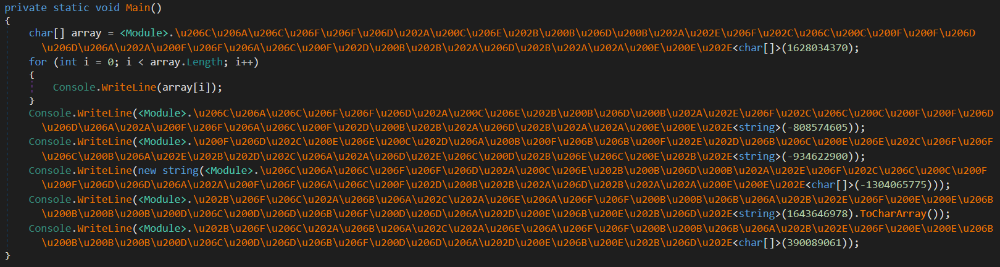
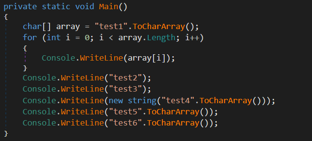

# ConfuserEx2_String_Decryptor
ConfuserEx2 is the latest version from the Confuser family → An open-source, free protector for .NET applications.<br/>
ConfuserEx2_String_Decryptor deobfuscates constants protection, targeting **string** objects and **char[]** arrays.<br/>
This tool was tested on the vanilla version of ConfuserEx2 (ConfuserEx 1.6.0+-), but it should also handle some customized versions.
> [!WARNING]
> **Run Only In VM** - The deobfuscation is based on a dynamic approach using managed hooking and reflection.<br/>

## ConfuserEx2 Websites
- [https://mkaring.github.io/ConfuserEx/](https://mkaring.github.io/ConfuserEx/)
- [https://github.com/mkaring/ConfuserEx](https://github.com/mkaring/ConfuserEx)

## Description
ConfuserEx2_String_Decryptor is a simple C# console application that uses: 
- **[AsmResolver](https://github.com/Washi1337/AsmResolver)** - .NET Assembly Manipulation (modification of IL code and metadata)
- **[Harmony2](https://github.com/pardeike/Harmony)** - Managed Hooking (to defeat some anti-checks)
- **[.NET Reflection](https://learn.microsoft.com/en-us/dotnet/framework/reflection-and-codedom/reflection)** - Dynamic Invocation

The [[Release]](https://github.com/Dump-GUY/ConfuserEx2_String_Decryptor/releases) binaries are compiled for both win-x86 and win-x64 using .NET Framework 4.7.2.<br/>

### Building on Windows
- Install Visual Studio<br/>
- Open .sln and restore NuGet packages (AsmResolver.DotNet, Lib.Harmony, etc.) → should be automatic if the NuGet URL is configured<br/>
- Build - Release both x86, x64<br/>

## Usage
- Use on unpacked samples (Dumped - Passing Module Constructor)<br/>
- ConfuserEx2_String_Decryptor.exe (32-bit) on 32-bit samples and (64-bit) on 64-bit samples<br/>
- **Drag&Drop** or **ConfuserEx2_String_Decryptor.exe \<filepath\>**<br/>

**BEFORE:**<br/>
<br/><br/>
**AFTER:**<br/>
<br/>

# ConfuserEx2 (1.6.0+-) Full Deobfuscation Guide
As a lot of malware devs, commodity malwares, and TAs are often using this obfuscator (avoiding older versions) to protect .NET samples, I put together some simple tools and steps that should help with deobfuscation.<br/>
This guide was tested on the vanilla version of ConfuserEx2, but it should also handle some simply customized versions.<br/>
> [!WARNING]
> **Run These Tools Only In VM** - Some of them are based on a dynamic approach using managed hooking and reflection.<br/>

## Description
Most of these tools are based on well-known open-source libraries and use:
- **[AsmResolver](https://github.com/Washi1337/AsmResolver) & [dnlib](https://github.com/0xd4d/dnlib)** - .NET Assembly Manipulation (modification of IL code and metadata)
- **[Harmony2](https://github.com/pardeike/Harmony)** - Managed Hooking (to defeat some anti-checks)
- **[.NET Reflection](https://learn.microsoft.com/en-us/dotnet/framework/reflection-and-codedom/reflection)** - Dynamic Invocation
- **De4dot** - CF deobfuscation and renaming (it is a different version than the original one)

The [[Release]](https://github.com/Dump-GUY/ConfuserEx2_String_Decryptor/releases) contains also all tools used in this guide "**ConfuserEx2_Deobfuscate_Tools.7z**" <br/>


## GUIDE - Steps

1. If the sample is packed (which means the IL code of the methods is not visible in tools like dnSpyEx), debug it and **dump it from memory** just after the **module constructor** execution is over, heading to the original entrypoint.
2. **Preserve** as much metadata as possible during the saving of the module from memory.
3. The **original entrypoint** is very often deleted from the .NET module metadata, so repair it in a tool like dnSpyEx.
4. Use the specific version of **de4dot** for CF cleaning and renaming.
    
    ```
    de4dot.exe <filepath> -p crx
    ```
    
5. Use the string decryption tools (**ConfuserEx2_String_Decryptor**) → 32-bit version on 32-bit samples and 64-bit version on 64-bit samples.
6. Use the **ProxyCall-Remover** to get rid of proxy methods (should help to inline them).

## GUIDE - Video
**[[YouTube]](https://github.com/Dump-GUY/ConfuserEx2_String_Decryptor/releases)**

## Something Not Working?

1. Follow the video guide.
2. Verify you **successfully unpacked** the protected sample - if it is packed (no IL code body or buggy decompilation in dnSpyEx) → debug the original sample/dll/loader to get over the module constructor of the protected sample → dump it from memory (dnSpyEx GUI).
3. Make sure it is protected by ConfuserEx2 and not some super old version from the Confuser family or an absolutely different protector.

